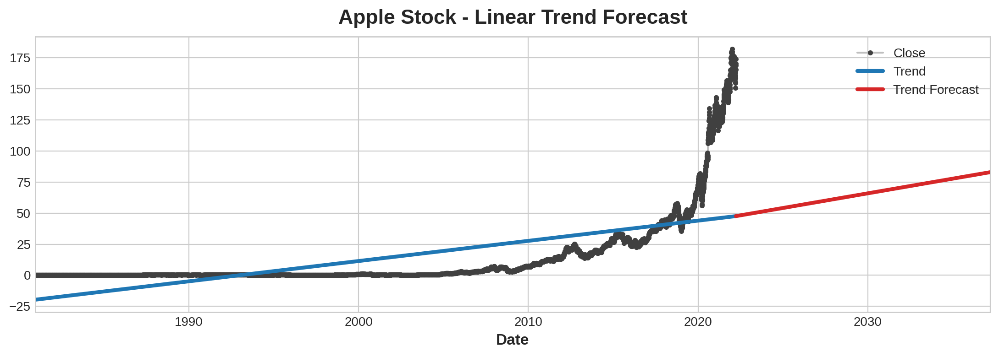
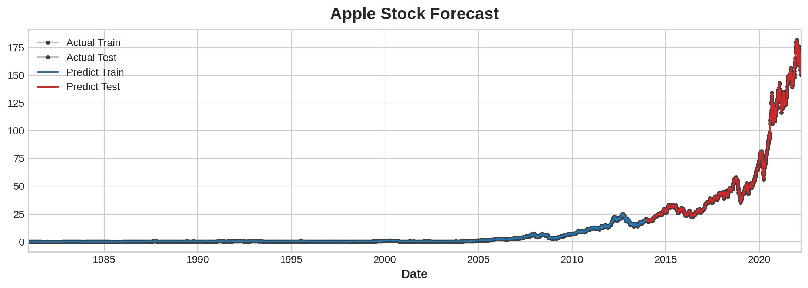
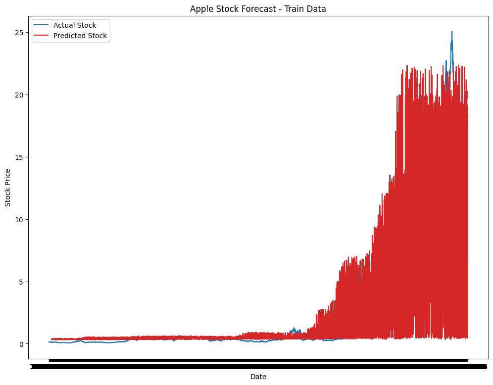
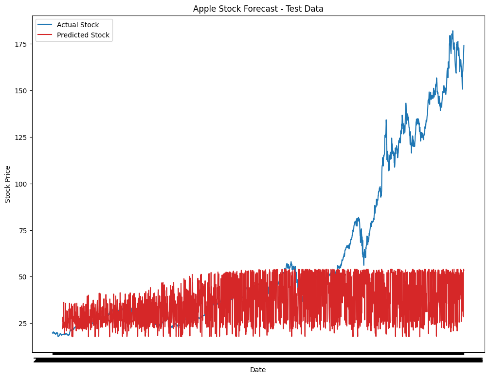

# TimeSeries-APPLE-Stock-Forecast
A project from dicoding Machine Learning Intermediate Class with Time Series data

## Traditional Approach

## Neural Networks Approach

## Dataset
- https://www.kaggle.com/datasets/varpit94/apple-stock-data-updated-till-22jun2021/data
- this is apple stock dataset
- currency is in USD
- available at daily level
- updated till 2021

## Approach
- [Neural Networks](Timeseries_Model.ipynb)
- [Traditional Machine Learning](Apple_Forecast.ipynb)

## Criteria
- free dataset with the minimum of 1000 sample
- must use LSTM
- validation set 20% from total dataset
- use model Sequential
- must use learning_rate on optimizer
- MAE < 10% of the data scale
### Optional Criteria (5*)
- dataset minimum 10000 sample

> note: this project has been executed, you only need to look
